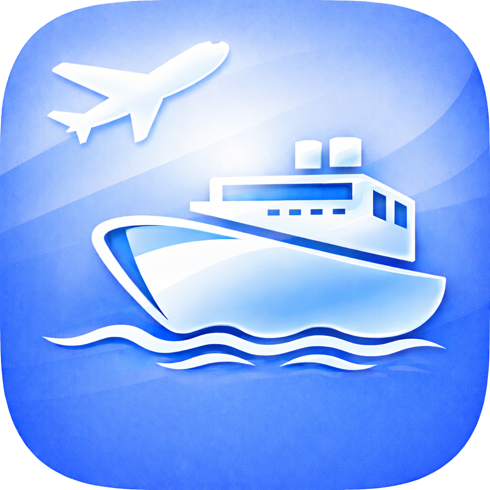

  

  
  

# ✈️ 🛥️ Sky and Sea Alert

**Sky and Sea Alert** is a lightweight Python [**MeshMonitor**](https://github.com/Yeraze/MeshMonitor) script that provides **aircraft overhead** and **vessel nearby** alerts for a configured latitude/longitude over [**Meshtastic**](https://meshtastic.org/), using **your own locally collected data** or **official cloud APIs**.

MeshMonitor handles **Meshtastic, webhooks, routing, and delivery**.  
Sky and Sea Alert focuses purely on **detection, filtering, and alert formatting**.

No scraping.  
No shared API keys.  
No direct radio transmission.

---

## 🚨 Major Release Notice (v2.0.0)

Sky and Sea Alert v2.0.0 introduced a **breaking architectural change**:

- ❌ No longer positioned as “free cloud API” software  
- ✅ Local receivers are now the **primary and recommended data source**  
- ✅ Cloud APIs are **explicitly optional and clearly labeled (paid / rate-limited)**  

This change removes API shutdown risk, ToS ambiguity, and onboarding confusion.

---

## ✅ Update Notice (v2.2.0)

v2.2.0 standardizes and documents **expanded aircraft cloud provider support**, while preserving the **local-first** architecture:

- ✅ Free/open aircraft cloud providers (no RapidAPI required)
  - **ADSB.lol** (recommended)
  - **airplanes.live**
  - **adsb.fi**
  - **ADSB One**
- ⚠️ **OpenSky** supported as a limited provider (eligibility and policies apply)
- 💲 **ADSBexchange via RapidAPI** remains supported as the paid option
- ✅ Local ADS-B + AIS remains the recommended and most sustainable path

---

## Quick Start (5-minute setup)

### 1) Clone or download

git clone https://github.com/maxhayim/sky-and-sea-alert.git  
cd sky-and-sea-alert

Or download `sky_and_sea_alert.py` directly.

---

### 2) Run demo mode (no hardware, no APIs)

export SSA_MODE=demo  
python sky_and_sea_alert.py

You should immediately see sample ✈️ and 🛥️ alerts.  
This verifies your environment and MeshMonitor formatting.

---

### 3) Set your location

export SSA_LAT=25.7816  
export SSA_LON=-80.2220

---

### 4) Choose your data source

- **Free & unlimited** → Local receivers (ADS-B + AIS) (recommended)
- **No hardware** → Cloud providers (free or paid)

---

### 5) Run live mode (choose one)

#### Option A — Local-first (recommended)

export SSA_MODE=sky_and_sea  
export SSA_ADSB_URL=http://127.0.0.1:8080/data/aircraft.json  
export SSA_AIS_URL=http://127.0.0.1:8181/ais.json  

python sky_and_sea_alert.py

(Use your actual local endpoints. See sections below.)

---

#### Option B — Free cloud aircraft (no RapidAPI)

export SSA_MODE=aircraft-cloud  
export SSA_AIRCRAFT_PROVIDER=adsblol  
python sky_and_sea_alert.py

Alternate providers:

export SSA_AIRCRAFT_PROVIDER=airplaneslive  
export SSA_AIRCRAFT_PROVIDER=adsbfi  
export SSA_AIRCRAFT_PROVIDER=adsbone  
export SSA_AIRCRAFT_PROVIDER=opensky  

---

#### Option C — Paid ADSBexchange via RapidAPI (optional)

export SSA_MODE=aircraft-cloud  
export SSA_AIRCRAFT_PROVIDER=adsbx_rapidapi  
export ADSBX_API_KEY="YOUR_RAPIDAPI_KEY"  
python sky_and_sea_alert.py

---

#### Option D — AIS Hub (account-based, rate-limited)

export SSA_MODE=vessels-cloud  
export AISHUB_API_KEY="YOUR_AISHUB_USERNAME"  
python sky_and_sea_alert.py

---

## Supported Data Sources (v2.x)

### ✈️ Aircraft (ADS-B)

#### ✅ Recommended: Local ADS-B Receiver (FREE)

- Hardware: RTL-SDR + ADS-B antenna
- Software:
  - dump1090
  - readsb
- Output: local JSON over HTTP

Flow:
ADS-B receiver → dump1090/readsb → Sky and Sea Alert → MeshMonitor → Meshtastic

No API keys.  
No rate limits.  
Real-time data.

Local aircraft endpoint (common default):

export SSA_ADSB_URL=http://127.0.0.1:8080/data/aircraft.json

---

#### 🐳 Docker “easy mode” (recommended for container users)

If you want a clean Docker-first ADS-B stack, look at **SDR-Enthusiasts** software offerings (e.g., ultrafeeder + readsb/tar1090).

Sky and Sea Alert stays the alerting layer; those stacks handle receiver/decoding and expose the same `aircraft.json` endpoint.

---

#### 🌍 Remote Access (VPN)

Local receivers can be accessed securely over the internet using a VPN.

Recommended VPN: Tailscale

- No port forwarding
- Encrypted
- Works behind NAT / CGNAT
- Ideal for Raspberry Pi deployments

Example:
Remote Pi (ADS-B) → Tailscale → Sky and Sea Alert → MeshMonitor

---

#### ☁️ Cloud Aircraft Providers (v2.2.0)

Use:

export SSA_MODE=aircraft-cloud  
export SSA_AIRCRAFT_PROVIDER=<provider>

Providers:

- adsblol (recommended)  
- airplaneslive  
- adsbfi  
- adsbone  
- opensky (limited)  
- adsbx_rapidapi (paid)

Cloud APIs can be rate limited and policies can change. Use responsibly.

---

##### ✅ ADSB.lol (recommended free cloud)

Base: https://api.adsb.lol

Provider:

export SSA_AIRCRAFT_PROVIDER=adsblol

Optional override:

export SSA_ADSBLOL_BASE=https://api.adsb.lol

---

##### ✅ airplanes.live (free + paid tiers)

API guide: http://api.airplanes.live/v2/  
(Provider defaults to https://api.airplanes.live in the script.)

Provider:

export SSA_AIRCRAFT_PROVIDER=airplaneslive

Optional override:

export SSA_AIRPLANESLIVE_BASE=https://api.airplanes.live

---

##### ✅ adsb.fi (open data)

Provider:

export SSA_AIRCRAFT_PROVIDER=adsbfi

Optional override:

export SSA_ADSBFI_BASE=https://opendata.adsb.fi/api

---

##### ✅ ADSB One (api.adsb.one)

Provider:

export SSA_AIRCRAFT_PROVIDER=adsbone

Optional override:

export SSA_ADSBONE_BASE=https://api.adsb.one

---

##### ⚠️ OpenSky Network (limited)

OpenSky’s policy may restrict access; eligibility requirements can apply.

Provider:

export SSA_AIRCRAFT_PROVIDER=opensky

Optional override:

export SSA_OPENSKY_BASE=https://opensky-network.org/api

---

##### 💲 ADSBexchange via RapidAPI (paid)

Official low-cost option:  
https://www.adsbexchange.com/api-lite/

RapidAPI listing:  
https://rapidapi.com/adsbx/api/adsbexchange-com1

Environment variable:

export ADSBX_API_KEY="YOUR_RAPIDAPI_KEY"

---

### 🛥️ Vessels (AIS)

#### ✅ Recommended: Local AIS Receiver (FREE)

- Hardware: RTL-SDR + VHF AIS antenna
- Software:
  - AIS-catcher
  - rtl_ais
- Output: local JSON or NMEA

Flow:
AIS receiver → AIS-catcher → Sky and Sea Alert → MeshMonitor → Meshtastic

Local AIS endpoint is user-provided:

export SSA_AIS_URL=http://127.0.0.1:8181/ais.json

---

#### 🌐 Optional: AIS Hub (Account-Based)

AIS Hub API page:  
https://www.aishub.net/api

How to get access:
1) Create an AIS Hub account  
2) Visit the API page above  
3) Use the AIS API tab  
4) Your API “key” is typically your AIS Hub username for the webservice  
5) Observe the documented rate limits

Environment variable:

export AISHUB_API_KEY="YOUR_AISHUB_USERNAME"

---

## Operating Modes

- demo — sample alerts, no data sources
- aircraft-local — local ADS-B receiver (dump1090/readsb)
- vessels-local — local AIS receiver (AIS JSON endpoint)
- sky_and_sea — local ADS-B + local AIS
- aircraft-cloud — cloud aircraft lookup (selected by SSA_AIRCRAFT_PROVIDER)
- vessels-cloud — AIS Hub (account-based)

---

## Requirements

- Python 3.8+
- Internet (optional for local-only mode)
- SDR hardware (optional, recommended)

No Docker required.  
No scraping.  
No shared credentials.

---

## Configuration (Environment Variables)

Core:

SSA_MODE=sky_and_sea  
SSA_LAT=25.7816  
SSA_LON=-80.2220  
SSA_AIRCRAFT_RADIUS_MI=10  
SSA_VESSEL_RADIUS_MI=3  
SSA_POLL_INTERVAL=60  
SSA_SUPPRESS_MINUTES=15  

Aircraft (Local):

SSA_ADSB_URL=http://127.0.0.1:8080/data/aircraft.json  

Aircraft (Cloud):

SSA_MODE=aircraft-cloud  
SSA_AIRCRAFT_PROVIDER=adsblol        (adsblol | airplaneslive | adsbfi | adsbone | opensky | adsbx_rapidapi)  
SSA_ADSBLOL_BASE=https://api.adsb.lol  
SSA_AIRPLANESLIVE_BASE=https://api.airplanes.live  
SSA_ADSBFI_BASE=https://opendata.adsb.fi/api  
SSA_ADSBONE_BASE=https://api.adsb.one  
SSA_OPENSKY_BASE=https://opensky-network.org/api  
ADSBX_API_KEY=your_rapidapi_key       (only for adsbx_rapidapi)  

Vessels (Local):

SSA_AIS_URL=http://127.0.0.1:8181/ais.json  

Vessels (Cloud):

SSA_MODE=vessels-cloud  
AISHUB_API_KEY=your_aishub_username  

---

## MeshMonitor Auto Responder Integration

Sky and Sea Alert is fully compatible with MeshMonitor Auto Responder scripting.

Commands:

!ssa  
!ssa sky  
!ssa sea  
!ssa demo  
!ssa help  

Output:

{ "response": "✈️ AAL123 6.1mi 9200ft" }

MeshMonitor handles:
- Meshtastic
- Webhooks
- Routing
- Channels
- Retries

Sky and Sea Alert never transmits on radios directly.

---

## Not Directly Supported (Documented Only)

The following ecosystems exist but are not directly integrated due to licensing, lack of stable public REST API, or commercial restrictions:

- ADSBHub
- adsb.exposed
- Fly Italy ADSB
- HPRadar
- FlightAware
- Flightradar24
- Plane Finder
- AirNav Radar
- Planespotters.net (not real-time ADS-B)
- Plane Watch (ACARS/data projects)
- radarvirtuel.com
- AV Delphi
- The Air Traffic

Sky and Sea Alert does not scrape websites or bypass terms of service.

---

## License

This project is licensed under the MIT License.

See the LICENSE file for details.  
Full license text: https://opensource.org/licenses/MIT

---

## Contributing

Pull requests are welcome. Open an issue first to discuss ideas or report bugs.

---

## Acknowledgments

* MeshMonitor built by [Yeraze](https://github.com/Yeraze) 
* Shout out and inspired by [TheFlightWall](https://github.com/AxisNimble/TheFlightWall_OSS)
* [ADSB.lol](https://www.adsb.lol)
* [airplanes.live](https://github.com/airplanes-live)
* [adsb.fi](https://github.com/adsbfi)
* [ADSB One](https://github.com/ADSB-One)
* [ADSBexchange](https://github.com/adsbexchange)
* [AIS Hub API](https://www.aishub.net/api)

Discover other community-contributed scripts for MeshMonitor: https://meshmonitor.org/user-scripts.html

